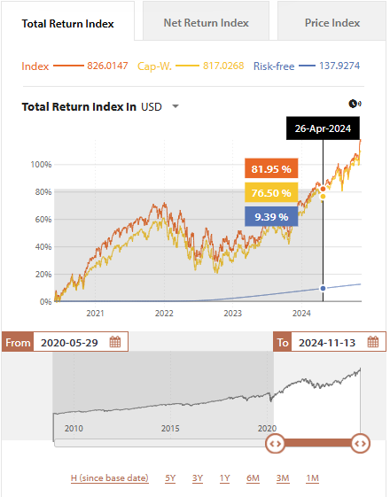

# Intership at Scientific Beta
a brief retrospective

---

<!-- _class: invert -->
# What is

---

<!-- _class: invert -->

> Established in 2012 by EDHEC-Risk Institute, Scientific Beta is a global index provider whose objective is to provide investors with the best passive investment solutions developed on the basis of rigorous academic research.

_[scientificbeta.com](https://www.scientificbeta.com/)_

<!--

They provide custom market indexes for large funds looking to invest at a rate that can match classic cap whighted performance while applying selection criteria for the indicies they invest in.

-->

--- 

# Global Context

In 2020 The Singapour Stock Exchange aquired SciBeta for **186 million** euros.

Late 2024 they planned a move away from the EDHEC infrastructure, IT department and location.

<!--

This move is a large change for the company, the IT department will change, along with it the whole security strategy, and laptops used. This is a large headache for Cedric.

Previosly all internal tooling was acessed through a VPN, all dev environment where dockers running on the remote server, this was to ensure continuous acess to the various backend services, while developing.

-->

---

# For whom?

A total of ~30 billion dollars invested

- Amundi ETF, Indexing & Smart Beta
- CoreShares
- Legal & General Investment Management
- Morgan Stanley

---

# Who are SciBeta? 

A relavitly small team of ~40 people in:

- Nice (primary location)
- Singapour
- London
- Boston

---

# The tech

- matlab (the index calculation core)
- microsoft server (index databases)
- .net (api layer)
- docker, centOS, ubuntu and AWS 
- apache (proxy and routing)
- django (cms and app backend)
- angular (SPA frontend)

---

<!-- _class: invert -->
# What do they do?

They procude market indexes that perform at the level of a capweighted index or better.

---

# `Scientific Beta Core Inflation+ Index`

> ... offer a substitute to traditional cap-weighted indices with the additional feature of offering positive exposure to expected inflation and also ensuring that all index constituents meet strict Environmental, Social and Governance (ESG) standards.

---

<!-- _class: invert -->
# Structure

Operations
Production
Index
Reaserch
Client services
Sales

<!--
Reaserch: will produce white papers, that they publish and participate the achademic reaserch there is a constant rate of student interns that assist with this.

Index: will attempt to make a finacial product out of the ideas from reasrch. Notably a strategy for calcuting an index. The product is an achademic paper describing the methodology for producing the index, some matlab code will also be produced but not published.

Production: Will using the paper as a spec will implement matlab code that will be used to calculate the index, this is corss referenced with Index as kinks are ironed out. The other aspect to produciton is the fronted website and it's accosiated services. Along with the infrastructure that underlies all this.

Operations: They ensure the index rebalancing is calculated each morning and the larger calculation performed each quarter taking into account and changes in index calculation methodology.

Client services and sales, they both serve a critical role but not one i am familliar with, though most often it's sales demading changes to the frontend code.

-->

---

# Production

A 4 person team responsible for the production of the website, and implementing the (core of the buisness) backend index calculation.

---

# What I did

- Started out with some booring requests to change frontend code, but got a commit to production with in the first week.
- Marketing wanted some excel automation, this was another task
- A redesign of the frontend card was also performed
- A potential for caching page data was explored, but this highlighted some errors in the page structure causing loading error. So was scrapped.
- Migrating the version of Angular from 13 to latest v18. This was overall not too ardous, but it requiered a change from material 1 to 2, this broke a large amount of styles, this was a long and very annoying process to fix. 
- During the above migration, a tool was developed to take screenshots of the different pages, and produce a diff. This was based on docker and angular.
